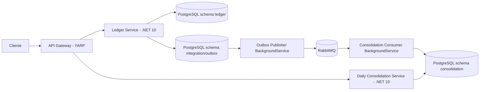

# Arquitetura Alvo

```mermaid
flowchart LR
  Client[Cliente] --> Gateway[API Gateway - YARP]
  Gateway --> Ledger[Ledger Service - .NET 10]
  Gateway --> Cons[Daily Consolidation Service - .NET 10]
  Ledger --> LedgerDb[(PostgreSQL schema ledger)]
  Ledger --> Outbox[(PostgreSQL schema integration/outbox)]
  Outbox --> Publisher[Outbox Publisher BackgroundService]
  Publisher --> Rabbit[(RabbitMQ)]
  Rabbit --> Consumer[Consolidation Consumer BackgroundService]
  Consumer --> ConsDb[(PostgreSQL schema consolidation)]
  Cons --> ConsDb
```

A solução usa microsserviços enxutos, comunicação assíncrona via RabbitMQ, Transactional Outbox no Ledger e modelo materializado para consulta do saldo diário.
